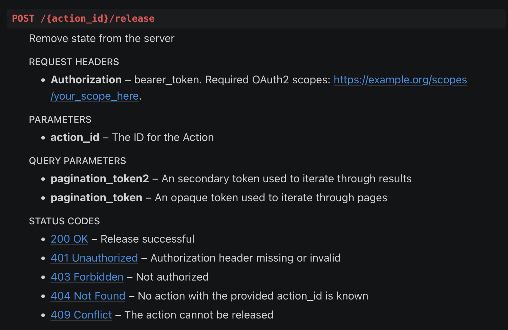

sphinx-simpleopenapi
--------------------

A WIP Sphinx extension library for rendering an OpenAPI spec.

Installation
^^^^^^^^^^^^

This extension is not published on PyPI. Install it directly from the source
repository to use it.

Once installed, add it to Sphinx's ``conf.py`` like so:

.. code-block:: python

    extensions = [
        ...
        "sphinx_simpleopenapi",
    ]

Usage
^^^^^

You can use this extension to render a JSON or YAML OpenAPI spec. The usage is:

``.. simpleopenapi:: _static/specs/openapi.yml``

Notice that the only parameter is the path to the OpenAPI spec.

This package will render the API routes, methods, path parameters, query
parameters and each route's expected OAuth2 scopes.

Examples
^^^^^^^^

This spec:

.. code-block:: YAML

    openapi: 3.0.0
    info:
    title: OpenAPI Spec
    description: This is an OpenAPI spec

    host: example.org
    basePath: /hello_world
    schemes:
    - https

    paths:
    /{action_id}/release:
        parameters:
        - name: pagination_token2
            required: false
            in: query
            description: >-
            An secondary token used to iterate through results
            schema:
            type: string
        - name: action_id
            required: true
            in: path
            description: |
            The ID for the Action
            schema:
            type: string
        - name: pagination_token
            required: false
            in: query
            description: >-
            An opaque token used to iterate through pages
            schema:
            type: string
        post:
        description: |
            Remove state from the server
        tags:
            - /release
        security:
            - bearer_token: ["https://example.org/scopes/your_scope_here"]
        responses:
            200:
            description: Release successful
            401:
            description: Authorization header missing or invalid
            403:
            description: Not authorized
            404:
            description: No action with the provided action_id is known
            409:
            description: The action cannot be released

    security:
    - bearer_token: []

    components:
    securitySchemes:
        bearer_token:
        type: oauth2
        flows:
            clientCredentials:
            tokenUrl: "https://example.org/oauth2"
            scopes:
                https://example.org/scopes/{provider_scope_name}: Authorization to perform operations
            authorizationCode:
            authorizationUrl: "https://example.org/oauth2"
            tokenUrl: "https://example.org/oauth2"
            refreshUrl: "https://example.org/oauth2"
            scopes:
                https://example.org/scopes/{provider_scope_name}: Authorization to perform operations

Would render as:

